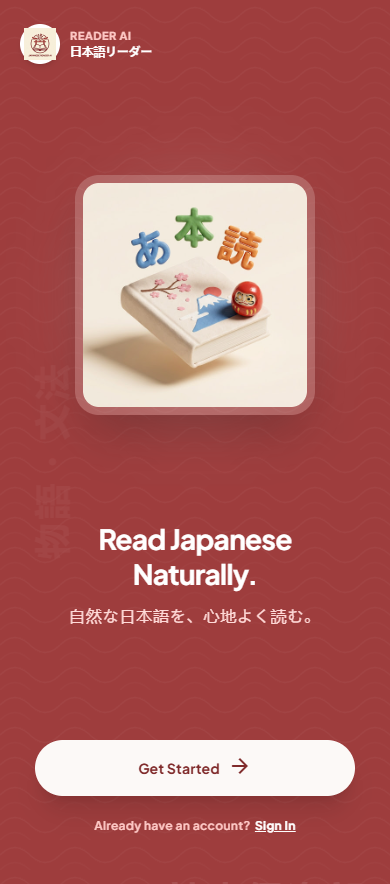
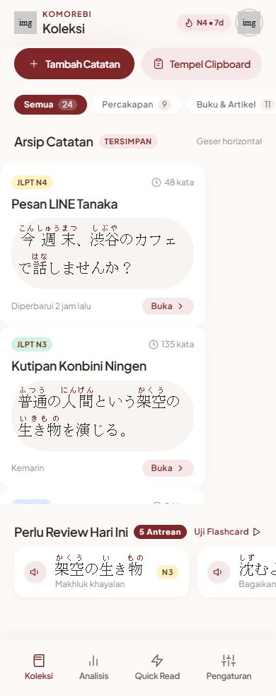
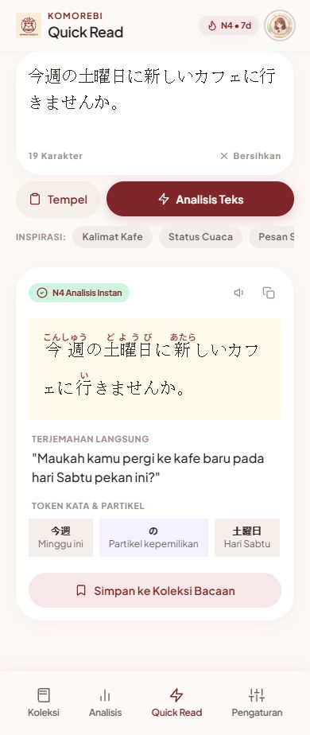
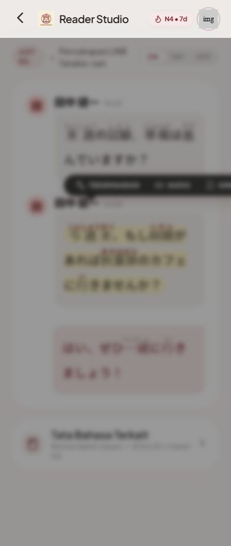
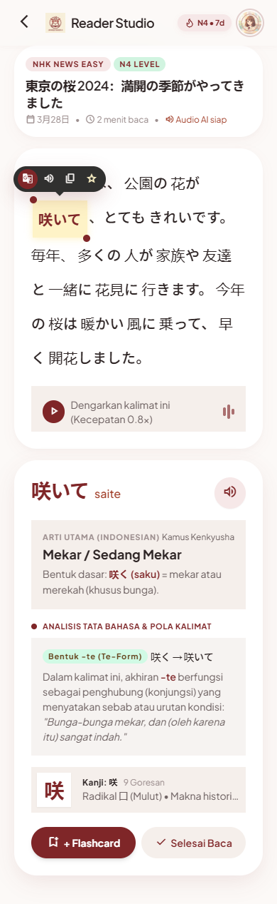
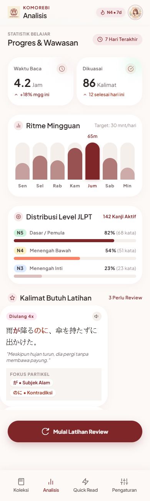
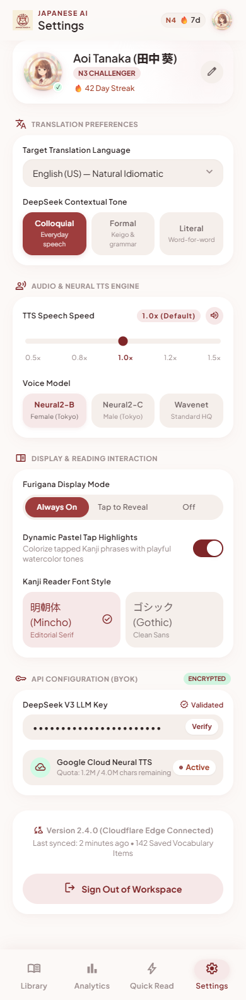

# Komorebi Reader (Japanese Reader AI)

<p align="center">
  
</p>

<p align="center">
  <strong>Platform Akselerasi Membaca Bahasa Jepang Lintas Platform (Android Native Kotlin & Cloudflare Edge Web)</strong>
</p>

<p align="center">
  
  
  
  
  
</p>

---

## 📸 Tangkapan Layar Aplikasi (Screenshots)

Berikut adalah antarmuka visual **Komorebi Reader** yang diimplementasikan secara presisi sesuai sistem desain Material 3 Jepang:

| 1. Onboarding & Splash | 2. Koleksi Catatan (3-Tab + FAB) | 3. Input Bacaan (Thumb-Zone) |
| :---: | :---: | :---: |
|  |  |  |

| 4. Chat Bubble Reader Canvas | 5. Bedah Tata Bahasa & Audio | 6. Kemajuan & Kosakata SRS |
| :---: | :---: | :---: |
|  |  |  |

| 7. Pengaturan & BYOK DeepSeek |
| :---: |
|  |

---

## 🌟 Pilar Utama Fitur & Desain

1. **100% Offline-First Architecture**:
   - Membaca, mendengarkan audio pengucapan, dan mencatat kosakata berjalan mandiri di HP tanpa ketergantungan internet melalui **Android Room SQLite** dan **Android Text-to-Speech Engine**.
2. **Chat Bubble Reading Studio**:
   - Format percakapan ramah dan santai.
   - **Tampilan Awal Bersih**: Bebas dari pop-up dan sorotan kuning bawaan.
   - **Furigana on-Demand**: Furigana dan warna pastel lembut muncul seketika saat kata disentuh.
   - **Auto-Save on Tap**: Sentuh kata untuk melihat arti konteks Bahasa Indonesia & bedah tata bahasa; sistem langsung otomatis menyimpannya ke dek belajar tanpa perlu tombol simpan manual.
   - **Pinch-to-Zoom Gesture**: Cubit layar dengan 2 jari untuk memperbesar/memperkecil teks dari `18sp` hingga `36sp`.
3. **Kontrol Audio Interaktif (Play / Stop Toggle)**:
   - Audio pengucapan tidak otomatis menyala agar nyaman di tempat umum.
   - Tombol speaker di lembar bawah berfungsi sebagai sakelar: sentuh untuk memutar (tombol berubah merah crimson), sentuh lagi untuk **menghentikan suara seketika**.
4. **Klasifikasi Level JLPT Dinamis (N5 - N1)**:
   - Menghitung tingkat kesulitan riil berdasarkan bobot kanji dan radikal (bukan nilai statis/hardcode).
5. **Ergonomi Jempol (Thumb-Zone Navigation)**:
   - Navigasi 3 tab inti (`Koleksi`, `Kemajuan & Kosakata`, `Pengaturan`) dengan tombol lingkaran besar **`(+) Tambah Bacaan`** di tengah jangkauan jempol.
   - Perpindahan antar halaman mulus menggunakan gestur geser (*swipe horizontal pager*).
6. **Cloudflare Edge Sync & DeepSeek BYOK**:
   - Terhubung ke Cloudflare Edge Worker (`https://komorebi-reader-api.hannabi3108.workers.dev`).
   - Dukungan *Bring Your Own Key* (BYOK) untuk DeepSeek AI LLM dengan verifikasi status langsung dan penyimpanan aman ganda (*SharedPreferences + Room DB*).

---

## 📦 Artefak Rilis (Folder `releases/`)

Binary aplikasi siap instal di perangkat Android:

- **APK File (Rilis)**: [`releases/komorebi-reader-v1.2.0.apk`](releases/komorebi-reader-v1.2.0.apk) (11.5 MB)
- **AAB File (Play Store Bundle)**: [`releases/komorebi-reader-v1.2.0.aab`](releases/komorebi-reader-v1.2.0.aab) (11.1 MB)
- **Store Icon (512x512)**: [`releases/icon-512.png`](releases/icon-512.png)
- **Application ID**: `com.japanesereader.ai`
- **Version**: `1.2.0` (Version Code: `102`)

---

## 🛠️ Panduan Build & Pengujian

### 1. Android Native App
```bash
cd android
# Menjalankan Unit Tests (JUnit & KSP)
./gradlew testReleaseUnitTest

# Mengompilasi APK dan AAB Release
./gradlew assembleRelease bundleRelease copyReleaseApk copyReleaseBundle
```

### 2. Backend Cloudflare Worker
```bash
cd backend
npm install
npm test
node node_modules/wrangler/bin/wrangler.js deploy
```

### 3. Web Client
```bash
cd web
npm install
node ../backend/node_modules/vitest/vitest.mjs run --root .
node node_modules/vite/bin/vite.js build
```

---

## 📄 Lisensi
Hak Cipta © 2026 Komorebi Reader AI. Dikembangkan sesuai spesifikasi teknis `Doc/Japanese Reader AI.md`.
